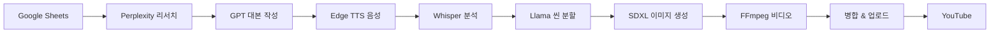

# YouTube Automation with n8n & AI (WSL2 Native)


**완전 무료**로 AI를 활용한 YouTube Shorts/Long 영상 자동 생성 파이프라인

- 🎯 **기획**: Perplexity AI 리서치
- ✍️ **대본**: Azure OpenAI GPT-4
- 🎙️ **음성**: Edge TTS (무료)
- 🖼️ **이미지**: SDXL-Turbo (로컬 GPU)
- 🎬 **영상**: FFmpeg Ken Burns 효과
- 📤 **업로드**: YouTube API 자동화

## 📊 월 운영 비용

| 항목 | 비용 |
|------|------|
| Azure OpenAI (대본 작성) | 3만원 |
| Perplexity Pro (리서치) | 무료 (2026.5까지) |
| 나머지 모든 AI 서비스 | **0원** (로컬) |
| **총 비용** | **3-6만원/월** |

기존 클라우드 AI 서비스 대비 **85-92% 절감** 💰

---

## 🏗️ Hareware Architecure(Laptop)

```
┌────────────────────────────────────────────┐
│         WSL2 (Ubuntu 22.04)                 │
│                                              │
│  ┌────────────────────────────────────┐    │
│  │      Docker (WSL 내부)              │    │
│  │  ┌─────────┐   ┌──────────┐       │    │
│  │  │   n8n   │◄─►│PostgreSQL│       │    │
│  │  │ (5678)  │   │  (5432)  │       │    │
│  │  └────┬────┘   └──────────┘       │    │
│  └───────┼─────────────────────────────┘    │
│          │                                   │
│          │ localhost 통신 (초고속)          │
│          │                                   │
│  ┌───────▼─────────────────────────────┐   │
│  │    AI Services (네이티브)           │   │
│  │  ┌─────────────────────────────┐   │   │
│  │  │ FastAPI (8000)              │   │   │
│  │  │  - TTS, Whisper, FFmpeg     │   │   │
│  │  └─────────────────────────────┘   │   │
│  │                                     │   │
│  │  ┌──────────┐  ┌───────────────┐  │   │
│  │  │ Ollama   │  │ SD WebUI      │  │   │
│  │  │ (11434)  │  │ (7860)        │  │   │
│  │  │ Llama3.1 │  │ SDXL-Turbo    │  │   │
│  │  └──────────┘  └───────────────┘  │   │
│  └─────────────────────────────────────┘   │
│              ▲                              │
│              │ GPU 직접 접근                │
│         GTX 1060 6GB                        │
└────────────────────────────────────────────┘
```

전체 아키텍처: [ARCHITECTURE.md](./docs/ARCHITECTURE.md)

---

## 🚀 빠른 시작 (Quick Start)

### 시스템 요구사항

- **OS**: Windows 11 (WSL2 지원)
- **GPU**: NVIDIA GTX 1060 6GB 이상
- **RAM**: 16GB 이상
- **Disk**: 50GB 여유 공간
- **기타**: CUDA 지원 GPU 드라이버 설치

### 설치 (3단계)

```bash
# 1. 저장소 클론
cd ~
git clone https://github.com/yourusername/youtube-automation-wsl.git
cd youtube-automation-wsl

# 2. 기본 환경 설정 (5-10분)
chmod +x scripts/*.sh
./scripts/setup_base.sh

# 3. AI 서비스 설치 (10-15분)
./scripts/setup_ai_services.sh

# 4. n8n 설정 (5분)
./scripts/setup_n8n.sh
```

상세 가이드: [설치 매뉴얼](./docs/INSTALLATION.md)

---

## 📖 사용 방법

### 서비스 시작

```bash
# 모든 서비스 시작
./scripts/start_all.sh

# 상태 확인
./scripts/health_check.sh
```

### 접속 주소

- **n8n**: http://localhost:5678 (admin / admin123)
- **FastAPI Docs**: http://localhost:8000/docs
- **Stable Diffusion**: http://localhost:7860
- **Ollama**: http://localhost:11434

### n8n 워크플로우 임포트

1. n8n 접속 → Settings → Import Workflow
2. `workflows/youtube-automation.json` 업로드
3. Credentials 설정 (Google Sheets, Azure OpenAI, YouTube API)
4. 워크플로우 활성화

---

## 📁 프로젝트 구조

```
youtube-automation-wsl/
├── README.md                    # 이 파일
├── ARCHITECTURE.md              # 상세 아키텍처
├── LICENSE
│
├── docs/                        # 문서
│   ├── INSTALLATION.md          # 설치 가이드
│   ├── TROUBLESHOOTING.md       # 문제 해결
│   └── API_REFERENCE.md         # API 문서
│
├── scripts/                     # 자동화 스크립트
│   ├── setup_base.sh           # 1단계: 기본 환경
│   ├── setup_ai_services.sh    # 2단계: AI 설치
│   ├── setup_n8n.sh            # 3단계: n8n 설정
│   ├── start_all.sh            # 서비스 시작
│   ├── stop_all.sh             # 서비스 중지
│   └── health_check.sh         # 상태 확인
│
├── docker-compose.yml           # n8n + PostgreSQL
├── .env.example                 # 환경 변수 템플릿
│
├── ai-services/                 # FastAPI 서버
│   ├── app.py                  # 메인 API
│   ├── requirements.txt
│   ├── services/               # 서비스 로직
│   │   ├── tts_service.py
│   │   ├── whisper_service.py
│   │   ├── llama_service.py
│   │   └── video_service.py
│   └── utils/
│
├── workflows/                   # n8n 워크플로우
│   └── youtube-automation.json
│
└── media/                       # 생성 파일 (자동 생성)
    ├── audio/
    ├── images/
    ├── videos/
    └── final/
```

---

## 🔧 주요 기능

### 1. 완전 자동화 파이프라인



### 2. 로컬 AI 서비스

- **Ollama (Llama 3.1 8B)**: 씬 분할, 프롬프트 생성
- **SDXL-Turbo**: 초고속 이미지 생성 (5-10초)
- **Whisper**: 음성 타임스탬프 추출
- **Edge TTS**: 고품질 한국어 TTS (무료)
- **FFmpeg**: Ken Burns 효과 비디오 생성

### 3. 확장 가능한 구조

- 새 AI 모델 추가 간편 (ComfyUI, AnimateDiff 등)
- 플러그인 방식 서비스 확장
- Docker 기반 격리

---

## 🛠️ 개발

### 로컬 개발 환경

```bash
# Python 환경 활성화
cd ~/youtube-automation-wsl/ai-services
source venv/bin/activate

# API 서버 실행 (개발 모드)
uvicorn app:app --reload --host 0.0.0.0 --port 8000

# 로그 확인
tail -f ~/youtube-automation-wsl/logs/fastapi.log
```

### API 엔드포인트

전체 API 문서: [API_REFERENCE.md](./docs/API_REFERENCE.md)

```bash
# TTS 생성
curl -X POST http://localhost:8000/api/generate-audio \
  -H "Content-Type: application/json" \
  -d '{"script":"안녕하세요", "voice":"ko-KR-InJoonNeural"}'

# 이미지 생성
curl -X POST http://localhost:8000/api/generate-image \
  -H "Content-Type: application/json" \
  -d '{"prompt":"a cat in space", "aspect_ratio":"16:9"}'
```

---

## 📊 성능

### Shorts 30초 영상 기준

| 단계 | 처리 시간 |
|------|----------|
| 리서치 + 대본 | 2분 |
| TTS 생성 | 30초 |
| 씬 분할 | 30초 |
| 이미지 생성 x6 | 1분 |
| 비디오 모션 x6 | 2분 |
| 병합 & 업로드 | 1분 |
| **총 시간** | **약 7-8분** |

### 리소스 사용

- **GPU**: 4-5GB VRAM (피크)
- **RAM**: 8-10GB
- **CPU**: 30-50% (6코어 기준)

---

## 🚨 문제 해결

### 자주 발생하는 오류

**1. GPU 인식 안됨**
```bash
# CUDA 확인
nvidia-smi

# WSL CUDA 재설치
# https://developer.nvidia.com/cuda/wsl
```

**2. Docker 권한 오류**
```bash
sudo usermod -aG docker $USER
# WSL 재시작: wsl --shutdown (Windows)
```

**3. 서비스 포트 충돌**
```bash
# 포트 사용 확인
sudo lsof -i :5678  # n8n
sudo lsof -i :8000  # FastAPI

# 프로세스 종료
sudo kill -9 <PID>
```

전체 문제 해결 가이드: [TROUBLESHOOTING.md](./docs/TROUBLESHOOTING.md)

---

## 🤝 기여하기

1. Fork the repository
2. Create your feature branch (`git checkout -b feature/AmazingFeature`)
3. Commit your changes (`git commit -m 'Add some AmazingFeature'`)
4. Push to the branch (`git push origin feature/AmazingFeature`)
5. Open a Pull Request

---

## 📝 로드맵

- [x] 기본 파이프라인 구축
- [x] 로컬 AI 서비스 통합
- [ ] AnimateDiff 비디오 생성 추가
- [ ] 자막 자동 생성
- [ ] 다국어 지원
- [ ] Web UI 대시보드
- [ ] 클라우드 배포 가이드

---

## 📄 라이선스

MIT License - 자유롭게 사용, 수정, 배포 가능합니다.

---

## 🙏 감사의 말

이 프로젝트는 다음 오픈소스 프로젝트를 기반으로 합니다:

- [n8n](https://github.com/n8n-io/n8n) - Workflow Automation
- [Ollama](https://github.com/ollama/ollama) - Local LLM
- [AUTOMATIC1111 WebUI](https://github.com/AUTOMATIC1111/stable-diffusion-webui) - Stable Diffusion
- [Whisper](https://github.com/openai/whisper) - Speech Recognition
- [FFmpeg](https://ffmpeg.org/) - Video Processing

---

## 📞 지원

- **Issues**: [GitHub Issues](https://github.com/youngmo37/youtube-automation/issues)
- **Discussions**: [GitHub Discussions](https://github.com/youngmo37/youtube-automation/discussions)
- **Email**: cloudmars2002@google.com

---

**⭐ 이 프로젝트가 도움이 되었다면 Star를 눌러주세요!**
# youtube-automation
# youtube-automation
