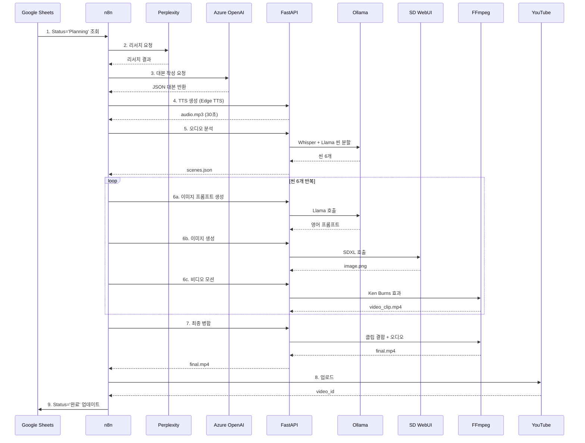

# 시스템 아키텍처

## 목차

1. [개요](#개요)
2. [전체 아키텍처](#전체-아키텍처)
3. [컴포넌트 상세](#컴포넌트-상세)
4. [데이터 플로우](#데이터-플로우)
5. [네트워크 구성](#네트워크-구성)
6. [보안 고려사항](#보안-고려사항)
7. [확장성](#확장성)

---

## 개요

이 시스템은 **완전 WSL2 기반**으로 구축된 YouTube 자동화 파이프라인입니다.

### 핵심 설계 원칙

1. **로컬 우선**: 최대한 많은 AI 작업을 로컬에서 처리 (비용 절감)
2. **단순성**: 모든 서비스가 WSL 내부에서 동작 (네트워크 단순화)
3. **확장성**: 플러그인 방식으로 새로운 AI 모델 추가 가능
4. **안정성**: systemd 기반 자동 복구

---

## 전체 아키텍처

```
┌─────────────────────────────────────────────────────────────┐
│                    Windows 11 Host                           │
│                                                               │
│  ┌───────────────────────────────────────────────────────┐  │
│  │               WSL2 (Ubuntu 22.04)                      │  │
│  │           GPU: GTX 1060 6GB 직접 접근                 │  │
│  │                                                         │  │
│  │  ┌─────────────────────────────────────────────────┐  │  │
│  │  │         Docker Engine (WSL Native)               │  │  │
│  │  │                                                   │  │  │
│  │  │  ┌────────────┐         ┌──────────────┐        │  │  │
│  │  │  │    n8n     │◄───────►│ PostgreSQL   │        │  │  │
│  │  │  │  (5678)    │         │   (5432)     │        │  │  │
│  │  │  └─────┬──────┘         └──────────────┘        │  │  │
│  │  └────────┼─────────────────────────────────────────┘  │  │
│  │           │                                             │  │
│  │           │ HTTP Requests                               │  │
│  │           │ (localhost - 초고속)                        │  │
│  │           │                                             │  │
│  │  ┌────────▼──────────────────────────────────────────┐ │  │
│  │  │              FastAPI Server (8000)                 │ │  │
│  │  │  ┌──────────────────────────────────────────────┐ │ │  │
│  │  │  │  Endpoints:                                   │ │ │  │
│  │  │  │  - POST /api/generate-audio                   │ │ │  │
│  │  │  │  - POST /api/analyze-audio                    │ │ │  │
│  │  │  │  - POST /api/generate-image-prompt            │ │ │  │
│  │  │  │  - POST /api/generate-image                   │ │ │  │
│  │  │  │  - POST /api/generate-video-motion            │ │ │  │
│  │  │  │  - POST /api/merge-videos                     │ │ │  │
│  │  │  └──────────────────────────────────────────────┘ │ │  │
│  │  └────┬────┬────────────┬──────────────────────────┘ │  │
│  │       │    │            │                             │  │
│  │  ┌────▼────▼────┐  ┌───▼──────────┐  ┌────────────┐ │  │
│  │  │   Ollama     │  │  SD WebUI    │  │   Native   │ │  │
│  │  │   (11434)    │  │   (7860)     │  │  Services  │ │  │
│  │  │              │  │              │  │            │ │  │
│  │  │ Llama 3.1 8B │  │ SDXL-Turbo  │  │ - Whisper  │ │  │
│  │  │              │  │              │  │ - Edge TTS │ │  │
│  │  │ - 씬 분할    │  │ - 이미지 생성│  │ - FFmpeg   │ │  │
│  │  │ - 프롬프트   │  │              │  │            │ │  │
│  │  └──────────────┘  └──────────────┘  └────────────┘ │  │
│  │          ▲                 ▲                          │  │
│  │          └─────────────────┴──────────────────────┐  │  │
│  │                      NVIDIA CUDA                   │  │  │
│  │                   (GPU 메모리 공유)                │  │  │
│  └─────────────────────────────────────────────────────┘  │
│                                                             │
│  외부 API 호출:                                             │
│  - Perplexity AI (리서치)                                  │
│  - Azure OpenAI (대본 작성)                                │
│  - YouTube Data API (업로드)                               │
│  - Google Sheets API (상태 관리)                           │
└─────────────────────────────────────────────────────────────┘
```

---

## 컴포넌트 상세

### 1. 오케스트레이션 계층 (Docker)

#### n8n Workflow Engine
- **역할**: 전체 파이프라인 조율
- **포트**: 5678
- **데이터베이스**: PostgreSQL 15
- **특징**:
  - 비주얼 워크플로우 편집
  - 스케줄 트리거
  - 에러 핸들링 & 재시도
  - Webhook 지원

#### PostgreSQL
- **역할**: n8n 워크플로우 및 실행 이력 저장
- **포트**: 5432 (내부 네트워크만)
- **볼륨**: `postgres_data` (영구 저장)

---

### 2. AI 서비스 계층 (Native)

#### FastAPI Server
```python
# 주요 역할
- API Gateway: 모든 AI 서비스 통합
- 요청 큐잉: GPU 과부하 방지
- 에러 핸들링: 재시도 로직
- 로깅: 통합 로그 관리
```

**기술 스택**:
- FastAPI 0.104+
- Uvicorn (ASGI 서버)
- Pydantic (데이터 검증)

**주요 엔드포인트**:

| 엔드포인트 | 메서드 | 설명 | 처리 시간 |
|-----------|--------|------|----------|
| `/api/generate-audio` | POST | TTS 음성 생성 | 10-30초 |
| `/api/analyze-audio` | POST | Whisper + Llama 씬 분할 | 1-2분 |
| `/api/generate-image-prompt` | POST | 씬 → 이미지 프롬프트 | 5-10초 |
| `/api/generate-image` | POST | SDXL 이미지 생성 | 5-10초 |
| `/api/generate-video-motion` | POST | FFmpeg 모션 효과 | 10-20초 |
| `/api/merge-videos` | POST | 최종 병합 | 1-2분 |

#### Ollama (Llama 3.1 8B)
```yaml
모델: llama3.1:8b (Q4 양자화)
VRAM: 4-5GB
용도:
  - 오디오 스크립트 씬 분할
  - 이미지 프롬프트 생성
  - 일관성 유지 (이전 프롬프트 참조)
```

**성능**:
- 추론 속도: 20-30 tokens/sec
- 컨텍스트: 4096 tokens
- 지연시간: 5-15초/요청

#### Stable Diffusion WebUI (SDXL-Turbo)
```yaml
모델: SDXL-Turbo 1.0 FP16
VRAM: 5-6GB
설정:
  - Steps: 4 (초고속)
  - Sampler: DPM++ SDE
  - CFG Scale: 2
```

**성능**:
- 생성 속도: 5-10초/이미지
- 해상도: 1024x576 (16:9) 또는 576x1024 (9:16)

#### Whisper
```yaml
모델: Whisper Base
메모리: CPU 메모리 사용
용도: 오디오 → 텍스트 + 타임스탬프
```

#### Edge TTS
```yaml
제공자: Microsoft Azure
언어: 한국어 (ko-KR)
목소리:
  - InJoonNeural (남성)
  - SunHiNeural (여성)
비용: 완전 무료
품질: ElevenLabs 70-80% 수준
```

#### FFmpeg
```yaml
용도: 비디오 처리
기능:
  - Ken Burns 효과 (zoom, pan)
  - 클립 병합
  - 오디오 싱크
  - 인코딩: H.264, AAC
```

---

### 3. 외부 API 계층

#### Perplexity AI
```yaml
API: Perplexity API
용도: 최신 트렌드 리서치
비용: 무료 (Pro 플랜, 2026.5까지)
```

#### Azure OpenAI
```yaml
모델: GPT-4o-mini (권장)
용도: YouTube 대본 작성
비용: ~3만원/월
출력: JSON 구조화 데이터
```

#### YouTube Data API
```yaml
인증: OAuth 2.0
용도: 최종 영상 업로드
API 할당량: 10,000 units/day
```

#### Google Sheets API
```yaml
용도: 콘텐츠 기획 및 상태 관리
인증: Service Account
```

---

## 데이터 플로우

### 전체 파이프라인 (Shorts 30초 기준)



### 파일 흐름

```
/home/user/youtube-automation-wsl/
├── media/
│   ├── audio/
│   │   └── {uuid}.mp3              # TTS 생성
│   │
│   ├── images/
│   │   ├── scene_1_{uuid}.png      # SDXL 생성
│   │   ├── scene_2_{uuid}.png
│   │   └── ...
│   │
│   ├── videos/
│   │   ├── motion_1_{uuid}.mp4     # FFmpeg 모션
│   │   ├── motion_2_{uuid}.mp4
│   │   └── ...
│   │
│   └── final/
│       └── shorts_{title}.mp4      # 최종 파일
```

---

## 네트워크 구성

### Docker 네트워크 (ai-network)

```
Bridge Network: 172.17.0.0/16

컨테이너:
├─ n8n:              172.17.0.2
└─ postgres:         172.17.0.3

Gateway: 172.17.0.1 (WSL 호스트)
```

### 서비스 간 통신

```yaml
# n8n → FastAPI
- URL: http://host.docker.internal:8000
- 또는: http://172.17.0.1:8000
- 프로토콜: HTTP/1.1
- 타임아웃: 60초

# FastAPI → Ollama
- URL: http://localhost:11434
- 프로토콜: HTTP/1.1

# FastAPI → SD WebUI
- URL: http://localhost:7860
- 프로토콜: HTTP/1.1
- 타임아웃: 120초 (이미지 생성)
```

### 포트 매핑

| 서비스 | 내부 포트 | 외부 포트 | 프로토콜 |
|--------|----------|----------|----------|
| n8n | 5678 | 5678 | HTTP |
| PostgreSQL | 5432 | - | TCP (내부만) |
| FastAPI | 8000 | 8000 | HTTP |
| Ollama | 11434 | 11434 | HTTP |
| SD WebUI | 7860 | 7860 | HTTP |

---

## 보안 고려사항

### 인증

```yaml
n8n:
  - Basic Auth (초기 설정)
  - 운영 환경: OAuth 2.0 권장

FastAPI:
  - 현재: 인증 없음 (localhost만 접근)
  - TODO: API Key 또는 JWT 구현

외부 API:
  - Azure OpenAI: API Key
  - YouTube: OAuth 2.0
  - Google Sheets: Service Account
```

### 데이터 보호

```yaml
민감 정보:
  - .env 파일로 관리
  - Git에서 제외 (.gitignore)
  - 환경 변수로 주입

API Keys:
  - n8n Credentials에 암호화 저장
  - PostgreSQL에 암호화 저장
```

### 네트워크 보안

```yaml
방화벽:
  - WSL은 Windows 방화벽으로 보호
  - 외부 접근 차단 (localhost만 바인딩)

Docker:
  - 내부 네트워크만 사용
  - 불필요한 포트 노출 안함
```

---

## 확장성

### 수평 확장 (Scale-out)

현재 아키텍처는 단일 노드 기준이나, 다음과 같이 확장 가능:

```yaml
확장 포인트:
  1. FastAPI 서버:
     - 여러 워커 프로세스 (uvicorn --workers 4)
     - Load Balancer 추가 (nginx)
  
  2. GPU 서버 분리:
     - SDXL 전용 서버
     - Ollama 전용 서버
     - FastAPI가 라우팅
  
  3. Redis 캐싱:
     - 이미지 프롬프트 캐싱
     - 생성된 이미지 해시 기반 중복 방지
```

### 수직 확장 (Scale-up)

```yaml
GPU 업그레이드:
  - RTX 3060 12GB: FLUX Pro 사용 가능
  - RTX 4090 24GB: AnimateDiff + I2V 모델 가능

메모리 증가:
  - 32GB RAM: 더 큰 Llama 모델 (13B, 70B)
  - 64GB RAM: 여러 모델 동시 로드
```

### 새 AI 모델 추가

```python
# ai-services/services/new_model_service.py

class NewModelService:
    def __init__(self):
        # 초기화
        pass
    
    async def process(self, input_data):
        # 처리 로직
        return result

# app.py에 엔드포인트 추가
@app.post("/api/new-model")
async def new_model(request: Request):
    service = NewModelService()
    return await service.process(request.data)
```

---

## 모니터링 및 로깅

### 로그 위치

```bash
~/youtube-automation-wsl/logs/
├── docker/
│   ├── n8n.log
│   └── postgres.log
├── ollama.log
├── sdwebui.log
├── fastapi.log
└── health.log           # health_check.sh 출력
```

### 메트릭 수집

```yaml
GPU:
  - nvidia-smi
  - VRAM 사용량, 온도, 사용률

시스템:
  - free -h (메모리)
  - df -h (디스크)
  - top (CPU)

서비스:
  - curl /health 엔드포인트
  - 응답 시간 측정
```

---

## 참고 자료

- [n8n Documentation](https://docs.n8n.io/)
- [Ollama Documentation](https://github.com/ollama/ollama/blob/main/docs/api.md)
- [AUTOMATIC1111 API](https://github.com/AUTOMATIC1111/stable-diffusion-webui/wiki/API)
- [FFmpeg Documentation](https://ffmpeg.org/documentation.html)
